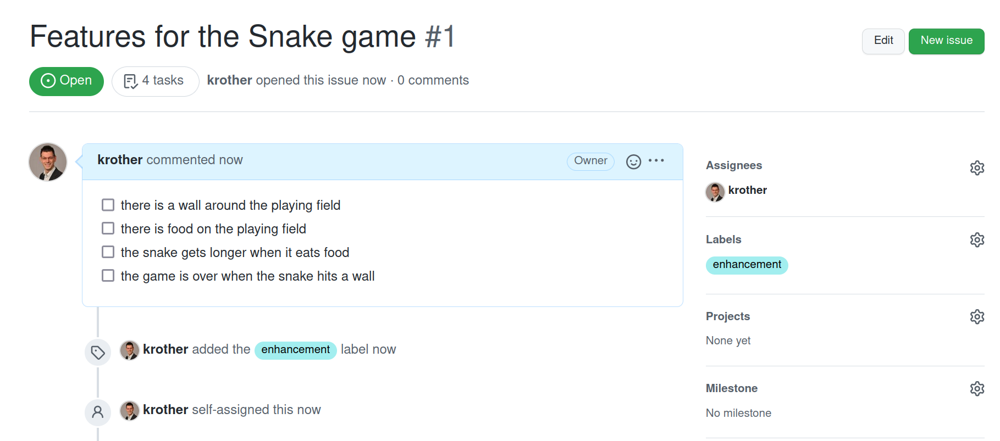
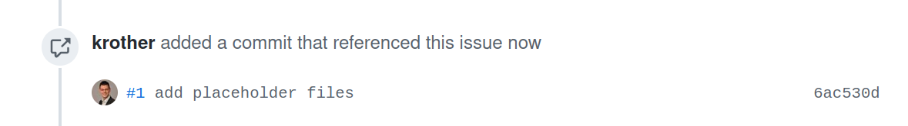

# Create Issues on GitHub

At the start of a project, you may want to plan a bit.
Much has been written about planning a software project, e.g. [User Stories](user_stories.md) or entire processes like Scrum.
However, for a small one-person project, a simple checklist is sufficient.
Let's collect a few features as an **Issue on GitHub**.

## Creating a new Issue

Go to the **Issues** tab on your repository on GitHub.
Press the big **New Issue** button on the right side.
Enter a title for the Issue, e.g.

    Features for the Snake Game

In the large text field below, you can add what is to be done.
There are plenty of controls to format text and attach files (e.g. screenshots).
One of the buttons lets you create a **Checklist**:

    - [ ] there is a wall around the playing field
    - [ ] there is food on the playing field
    - [ ] the snake gets longer when it eats food
    - [ ] the game is over when the snake hits a wall

----

## Annotate the Issue

On the right side, there are a few extra controls.
These are mostly useful in projects with more persons, but you may want to find out what they do:

* in **Assignees** you can specify who is responsible for that issue. So you might add yourself here.
* **Labels** describes the type of issue. I tend to label new features as **enhancement** or create my own labels.
* **Projects** and **Milestone** really do not make any sense unless you have 20+ issues open.

Finish the procss by pressing the big button **Submit new Issue** at the bottom.
The final issue might look like this:

----

## Referencing the Issue

You can reference GitHub issues in commits with a message that starts with a `#` and the number of the issue.
Suppose you add and commit the placeholder files `game.py` and `__main__.py` with:

    git add snake/game.py
    git add snake/__main__.py

    git commit -m "#1 add placeholder files"

As soon as you push the change, you should see a note in your issue:

----

## Exercise

What features would you want to see in your game?
Add a few more items to your checklist.

Even if you will not implement everything in the end (which is BTW very common in software projects),
having a checklist helps you to prioritize your work and see your progress.
