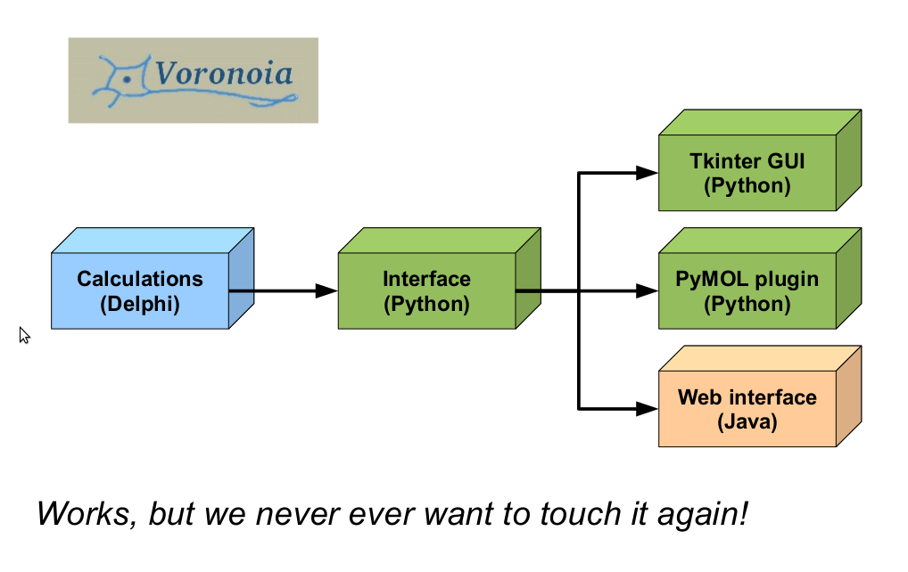

# The Voronoia Story

### Purpose:
Calculate packing density of
protein 3D structures.

### Developers:
3 coders
1 tester
1 project owner

### Duration:
2 years (backend)
6 months (interface)
Python libs:
Tkinter

### Results:
published in Nucl.Acids.Res.
(2009)
