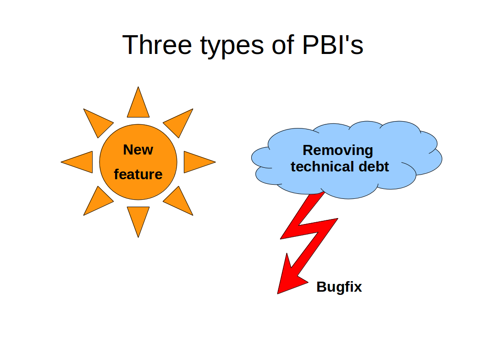

# Product Backlog

## Product Backlog Items
PBI's should be
* Independent – explain themselves.
* Negotiable – all stakeholders understand them.
* Valuable – benefit for the customer.
* Estimable
* Small – must fit into a sprint.
* Testable

