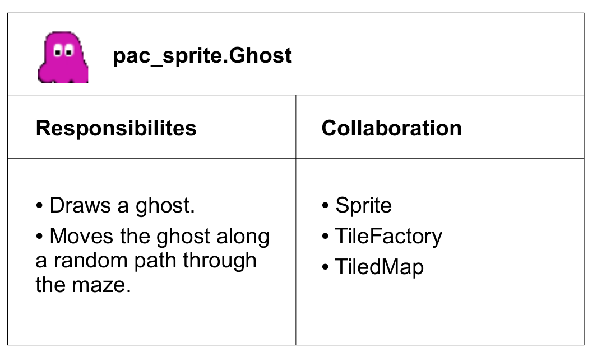

# CRC Cards

CRC means Class-Responsibility-Collaboration. In brief, CRC cards are a tool that help you to build a good architecture for your program. They were proposed by Ward
Cunningham and Kent Beck.

This text explains
1. how CRC cards work
2. what they are good for
3. pros and cons of CRC cards.

### How do CRC cards work?
Imagine a small Pacman game. You move a hungry yellow smiley through a maze, eat lots
of dots while a bunch of ghosts is chasing you. The game is implemented with a separate
class for the ghosts in a code module called pac_sprites. The CRC card describes what
the Ghost class is responsible for and what it needs to do its job.

On top of the CRC card there is the full class name: pac_sprites.Ghost.

Most of the card is divided into a left and right half. On the left side, responsibilities are
written; this is what the Ghost class does: Displaying a ghost and constantly moving the
ghost on a random path. On the right side, collaborations are listed: all other program
components that the Ghost needs to work. In this example, the Ghost needs a Sprite class
to display itself, it needs a TileFactory to load graphics, and a TiledMap where it moves on.
With this, the CRC card for the Ghost is complete.
In the same way, you can write CRC cards for many components of a program. They don't
necessarily need to be classes, you can create CRC cards for modules, packages,
libraries, or however organizational units in your favorite language are called. Also you can
write important files into the collaboration column. Taken together, a CRC card consists of
a name of a program component, a list of responsibilities on the left side, and a list of
collaborating components on the right side.

### What are CRC cards good for?
CRC cards are useful in two situations:
The first situation is when you are designing the architecture for a new program. You
already have detailed knowledge what the program should do, but you need to decide how
the work will be divided up among different program components. The CRC cards help you
to try different possibilities on paper before implementing them. For example, you might
have the idea that instead of a Ghost class you want a GhostManager class that takes
care of drawing and moving all the ghosts. The CRC cards allow you to compare both
versions and discuss their strengths and weaknesses.
The second situation is when you need to refactor messy parts of a program. When you
have lots of code that need improvement, but you don't know exactly what it does, you can
write CRC cards to document your progress of understanding the code. When you read
the cards, it will be easier for you to notice classes that don't really do much, or
responsibilities that are redundant. For example, if you find a GhostMover class in addition
to the Ghost, and both are responsible for moving ghosts, then it may be worth to get rid of
one of them.
Taken together, CRC cards can be used to design an architecture and to clean up an
existing program.

### What are advantages and disadvantages of CRC cards?
On the positive side, using CRC cards is easy and it doesn't take much time to write them,
e.g. on A6 paper cards. Such cards can be rearranged easily during a discussion. CRC
cards facilitate teams to focus on object oriented programming and allow everybody to
contribute to the design. Also, CRC cards do not need to be complete to have value (as
opposed to detailed specifications, where omissions can have severe consequences). If
you decide that you need to focus on a few classes and draw CRC cards just for them,
that is fine. On the negative side, the cards lack detail and precision. There is no place to
explain how a class may actually work (expect for maybe mentioning a Design Pattern).
Also, there is absolutely no procedural information like in what sequence events are to
take place.

Now, why to use CRC cards instead of a class diagram? I agree that both CRC cards and
UML class diagrams describe the architecture of a software. But, the class diagram is a
very precise technical blueprint. If you already know exactly what you need, the class
diagram is great. But if you are thinking about what classes there could possibly be, and
dont want to worry about relationships, methods, or attributes yet, CRC cards offer a less
final method that leaves you freedom for designing details later. The CRC card describes
what a class is good for, which the class diagram doesn't. You can use CRC cards as a
stepping stone in the early stages of developing your class architecture.

### Summary
CRC cards describe the architecture of a software. They describe components like classes
or packages, their responsibilities, and collaborations they need to work correctly. CRC
cards are easy to use to design a new architecture or clean up an existing one.
