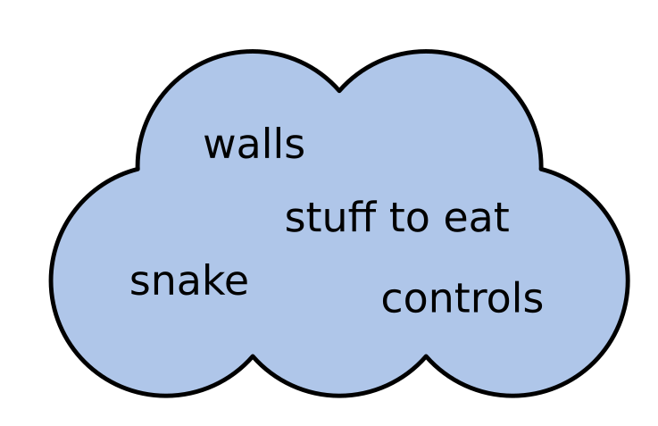

# Define an Interface

One of the most difficult questions about writing your program is deciding where to start.
You probably would like to divide the program into smaller components.
So for a snake game, you would separate the snake from the playing field separate the walls from the food and so on.
At this stage, these concepts are still floating in space:

When you think about converting the words in this cloud to code, you discover a problem:
Should there be a Snake class? Could you implement the snake with functions instead? Should you implement the tail as a list, a dictionary or something else?

In this article, we will approach these questions.

## Change is inevitable

One key property of software is that it will change over time.
While you develop, you learn more about the problem you are solving.
This means that your initial implementation will turn out to be not so great, and you will have to modify it.
This is also common when you are maintaining software over a longer period, and your requirements slowly change.
This change is inevitable.

You can think about the classes, functions and data structures of your program as the interior design of a building.
It is very important for the functionality and comfort where you place the furniture.
But you also know that you may want to replace or rearrange the furniture sometimes.
The design of the interior is temporary, and the design of classes, functions and data structures is temporary, too.

Practically this means: **In the beginning, it does not matter much whether we implement the snake as a class or a list or a bunch of functions, because it is going to change anyway.**
What we need is to embed the snake component in a program structure that makes it easy for us to change its implementation in the future.

Where do we expect change in the snake game?
First, the game mechanics could change: There could be more walls or multiple food items being added in the future.
Second, we might want to change the user interface as well, replacing the terminal view by actual graphics.
A key point is that these are two types of changes.
We should separate them.

## The Interface

What we are looking for at this stage is to identify something that does not change: the walls, doors and windows of your building (or software).
We call these **interfaces**.
Interfaces are what connects one part of your program to another.
While both parts may change, the interface should remain stable.

Let's separate the **User Interface** of the snake game from the **Game Logic**.
For that, we will define a `SnakeGame` class that will be used as the only point of communication by the user interface:

    :::python3
    class SnakeGame:

        running: bool

        def start_game():
            ...

        def set_direction():
            ...

        def update():
            ...

        def get_tiles():
            ...

Instead of a class, you could do the same using functions, JSON objects or something else.

## An interface is a contract

A key property of an interface is that we expect it to be stable over a long time.
With a stable interface, we can do things that make little sense with temporary components:

* implement different graphical clients that use the same game logic
* altrnative implementations of the interface (e.g. implement pacman instead of snake)
* write automated tests against the interface
* write documentation for the interface

Concluding, the user interface can use the `SnakeGame` interface without knowing anything about the game logic.
Likewise, the `SnakeGame` class can handle the game logic (using any extra classes or functions it needs) without knowing how the playing field is displayed or how the player controls the snake.

## Further Reading

See [Lehmanns Laws of Software Evolution](https://en.wikipedia.org/wiki/Lehman%27s_laws_of_software_evolution)
