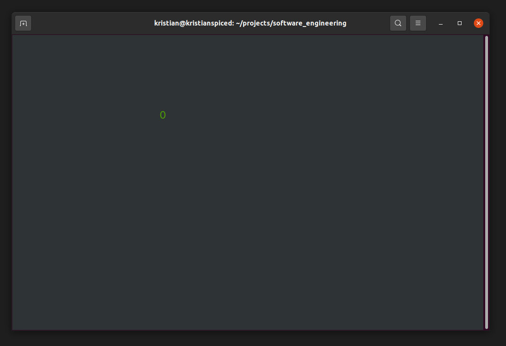

# The Prototype

Before attempting a more costly clean implementation, you may want to check whether the project is feasible at all.
You can do such a check by implementing a quick and dirty proof of concept: a **prototype**.
The goal of a prototype is usually to reduce risks in a project.

A prototype can answer questions like:

* is my programming environment set up properly?
* can we solve a particular algorithmic problem?
* does a library do what we need?
* is the algorithm/library fast enough?
* what safety/security risks are there?
* did we understand the customer correctly?

## A Prototype for a Snake game

The following code is a prototype for a Snake game.
The program is a simple game where you move a symbol around with the `WASD` keys.
The goal of this prototype is to prove that we can process keyboard input and draw into a terminal. 

:::include prototype.py

## Exercise: Run the prototype

#### Step 1

Save the code in :::file prototype.py to a Python module.

#### Step 2

On Windows, you need to install `windows-curses`:

    :::bash
    pip install windows-curses

#### Step 3

Change to the directory with the `.py` file and execute the code with:

    :::bash
    python prototype.py
    
You should see a screen where you can control the `'O'` with the keys **W, A, S and D**:

## Reflection Questions

Discuss the following questions:

* Why do you think is the prototype focused on testing the input/output library?
* Is it more work to write a cleaner version of the prototype later? Why or why not?
* Is there any code that you don't understand?
