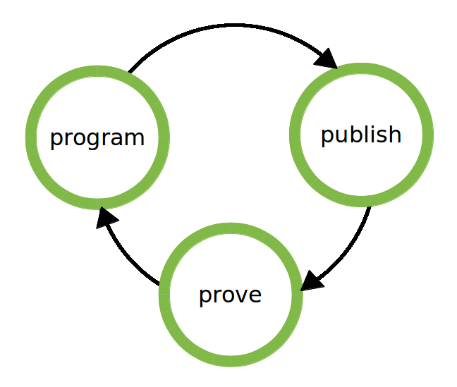

# How to create meaningful software?

## Program-Publish-Prove
### A cycle to develop working software

Over the last 10 years, Agile methodologies have been constantly growing in popularity. Today, many developers use Agile best practices on an everyday basis: User Stories, Test- Driven-Development, and frameworks like Scrum [http://www.scrum.org].

Now, leading developers claim that Agile methodologies are being over-used in a way that is not Agile any more, i.e. focusing on best practices violates the principle "Individuals and interactions over processes and tools" from the Agile manifesto [http://agilemanifesto.org/]
. The alternative is a scientific development model: **Program - Publish - Prove**.

In this chapter, we present three inspiring voices that helped give birth to this model.

### 1. Program

Zed Shaw pins down the problem in his Programming Motherfuckers Manifesto [http://programming-motherfucker.com]
. In his manifesto, Zed says Agile is creating unnecessary overhead and inefficiency. For example, the Agile value "Responding to change" became distorted into "Instability and plausible deniability". More precisely, when during an iteration a feature is not working or not finished yet, that feature is shifted to the next iteration. In other words, using iterations provides developers with a mechanism by which they can get away with unfinished code. And because the development is iterative, developers could get away with bad code over and over.

For Zed, there is only one way out: Skip the methodological blur - program, motherfucker.

### 2. Publish the code

Fred George values Agile principles, but doesn’t use any of the standard tools (standup meetings, pair programming, iterations, etc.). In his team, Programmer Anarchy, at Forward Technology [http://forwardtechnology.co.uk/videos/32447325], programmers assign themselves to projects freely from day to day. Developers talk to the customers directly, bring forward their own ideas, and implement them. They team up with colleagues as required, and can participate in multiple projects in parallel.

Releasing the product to the customer is key to make this approach successful. The short communication channel allows developers to get out their code quickly and have it tested under fire. In one week at Programmer Anarchy, 40 developers working on 86 projects deployed their code 577 times. And many of the 577 deploys create business value [http://blip.tv/rupy-strongly-dynamic-conference/fred-george-programmer-anarchy-5731495].

Publishing code frequently allows the customer to understand what is happening, and make decisions accordingly. In this tight interaction, there is no place for a Product Owner, Iteration Manager, or Business Analyst. Instead, the interaction fuels lasting trust between customer and programmer.

To create trust, you don’t need a boatload of management tools. Programmers can work self-responsibly – they are actually very good at that.

### 3. Prove that it is useful

Obie Fernandez emphasizes that just programming and publishing code is not enough. You need something to control and improve quality. Obie propagates a scientific approach: Instead of using tests that make sure your software is technically correct, you measure what effect it has on your customers business (or your own).

Here, you can reap the full benefits from Kissmetrics [http://blog.kissmetrics.com/], Google Analytics [http://www.google.com/intl/en_uk/analytics/], and other web-based analytics software. Web-based metrics became popular, because they essentially allow you to prove scientifically that the code you wrote makes life better (makes people happy, gets you money, or both).

Obie connected the above ideas to a new post-Agile paradigm [http://blip.tv/rupy-strongly-dynamic-conference/obie-fernandez-the-next-big-leap-5948818].

In a nutshell, the idea is to:
1. program: take an idea and implement the code.
2. publish: expose the code to the real world.
3. prove: measure whether the code improves what the customer wants.

#### Iterate

This circle can be iterated quickly by a single person. The Program - Publish - Prove model clearly reflects the decade that has passed since Agile was introduced. In 2000, you needed a team to create quality code. There was no Ruby on Rails, no Google Analytics, no Facebook and Twitter buttons you could plug into your website. Today, each developer is a one-man-army capable of building even their own search engine [http://www.udacity.com]. All you need is passion, a laptop, and a scientific mindset.

### Conclusion

In the Program-Publish-Prove paradigm, you create software, release it quickly, and prove that it is useful. The model preserves the key values of Agile: Face-to-face communication, quality, and productivity. The great achievement of Agile were engineering procedures to create working software.

Now, it is time to make that software meaningful.
